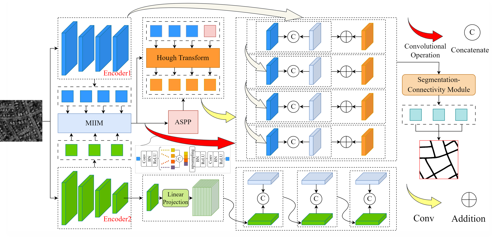

## DCREN Research Code Help

### Introduction

We propose a two-branch network (DCREN) for road extraction. Our method integrates multi-scale information interaction modules, combining Hoff transform modules and connectivity modules to promote co-evolution to aggregate feature information of different scales across spatial information, enhance line features in feature maps of different scales, and enhance road connectivity according to road topological relationships. The quantitative analysis results on two public data sets show that our method has superior performance, and the mloU extracted by road is the highest on both public data sets.



### Requirements

The code is built with the following dependencies:

- Python 3.6 or higher
- CUDA 10.0 or higher
- [PyTorch](https://pytorch.org/) 1.2 or higher
- [tqdm](https://github.com/tqdm/tqdm.git)
- matplotlib
- pillow
- tensorboardX

### Data Preparation

*Download zurich dataset in the following tree structure.*
```
mass
│
└───gt
│   └───388_mask.png
└───labels
│   └───388_mask.png
└───images
│   └───388_sat.png
```

*Download mass dataset in the following tree structure.*
```
mass
│
└───gt
│   └───388_mask.png
└───labels
│   └───388_mask.png
└───images
│   └───388_sat.png
```
```
mass
|   train.txt
|   val.txt
|   train_crops.txt   
|   val_crops.txt     
|
└───gt
│
└───images
│
└───labels
│
└───crops
│   └───connect_8_d1	
│   └───connect_8_d3	
│   └───gt		
│   └───images	
│   └───labels
```

### Training
Follow steps below to train your model:

1. Configure your dataset path in [mypath.py].
2. Configure the following parameters in train.py or enterthe command line directly in the terminal.

Command Lines:
```
python train.py --dataset=mass --gpu-ids 0 --base-size 512 --crop-size 512 --epochs 50 --batch-size 4
```

### Testing
Configure the following parameters in test.py or enter the command line directly in the terminal.
- zurich
```
python test.py --ckpt='./run/DCREN-zurich.pth.tar' --out_path='./run' --dataset='zurich' --base_size=512 --crop_size=512
```
- mass
```
python test.py --ckpt='./run/DCREN-mass.pth.tar' --out_path='./run' --dataset='mass' --base_size=512 --crop_size=512
```

### Evaluateing

To evaluate the accuracy of the prediction results, we use the eval.py code alone.


